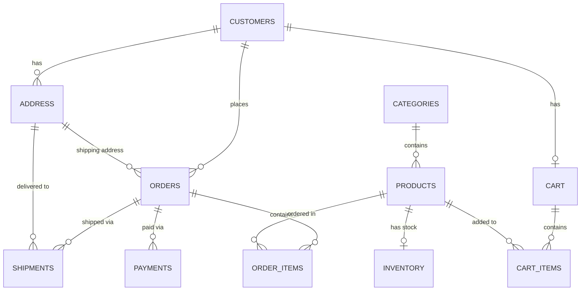

# E-Commerce Database Schema Documentation

This document describes the structure, tables, columns, relationships, and DDL scripts for the `e_commerce` database.

---

## Entity-Relationship Diagram (ERD)



---

## Database Tables Overview

| Table Name | Description | Primary Key | Foreign Keys |
| :--- | :--- | :--- | :--- |
| **`customers`** | Stores customer personal details and account creation timestamp | `customer_id` | None |
| **`address`** | Stores shipping & billing address details of customers | `address_id` | `customer_id` → `customers(customer_id)` |
| **`categories`** | Product categories/departments | `category_id` | None |
| **`products`** | Available products with pricing and category | `product_id` | `category_id` → `categories(category_id)` |
| **`inventory`** | Tracks stock quantity available per product | `inventory_id` | `product_id` → `products(product_id)` |
| **`cart`** | Shopping cart owned by a customer | `cart_id` | `customer_id` → `customers(customer_id)` |
| **`cart_items`** | Items added to shopping carts | `cart_item_id` | `cart_id` → `cart(cart_id)`, `product_id` → `products(product_id)` |
| **`orders`** | Customer order details and totals | `order_id` | `customer_id` → `customers(customer_id)`, `address_id` → `address(address_id)` |
| **`order_items`** | Line items for completed orders | `order_item_id` | `order_id` → `orders(order_id)`, `product_id` → `products(product_id)` |
| **`payments`** | Payment transaction details per order | `payment_id` | `order_id` → `orders(order_id)` |
| **`shipments`** | Logistics and delivery tracking information | `shipment_id` | `order_id` → `orders(order_id)`, `address_id` → `address(address_id)` |

---

## Detailed Table Structures

### 1. `customers` Table
Stores registered user accounts.

| Column Name | Data Type | Nullable | Key / Constraint | Default | Description |
| :--- | :--- | :--- | :--- | :--- | :--- |
| `customer_id` | `INT` | NO | PRIMARY KEY AUTO_INCREMENT | *Auto* | Unique ID for each customer |
| `first_name` | `VARCHAR(20)` | NO | — | — | First name of customer |
| `last_name` | `VARCHAR(20)` | NO | — | — | Last name of customer |
| `e_mail` | `VARCHAR(30)` | NO | UNIQUE | — | Customer email address |
| `phone_number` | `VARCHAR(15)` | NO | — | — | Contact phone number |
| `created_at` | `TIMESTAMP` | YES | — | `CURRENT_TIMESTAMP` | Timestamp of account registration |

---

### 2. `address` Table
Stores addresses linked to customers.

| Column Name | Data Type | Nullable | Key / Constraint | Default | Description |
| :--- | :--- | :--- | :--- | :--- | :--- |
| `address_id` | `INT` | NO | PRIMARY KEY AUTO_INCREMENT | *Auto* | Unique ID for each address |
| `customer_id` | `INT` | NO | FOREIGN KEY | — | References `customers(customer_id)` |
| `address_line` | `VARCHAR(50)` | NO | — | — | Street address / house number |
| `city` | `VARCHAR(20)` | NO | — | — | City name |
| `state` | `VARCHAR(20)` | NO | — | — | State name |
| `pincode` | `VARCHAR(10)` | NO | — | — | Postal / PIN Code |
| `country` | `VARCHAR(20)` | NO | — | `'INDIA'` | Country name |

---

### 3. `categories` Table
Stores product classification categories.

| Column Name | Data Type | Nullable | Key / Constraint | Default | Description |
| :--- | :--- | :--- | :--- | :--- | :--- |
| `category_id` | `INT` | NO | PRIMARY KEY AUTO_INCREMENT | *Auto* | Unique category ID |
| `category_name` | `VARCHAR(20)` | NO | UNIQUE | — | Category title |
| `created_at` | `TIMESTAMP` | YES | — | `CURRENT_TIMESTAMP` | Category creation timestamp |

---

### 4. `products` Table
Stores catalog products.

| Column Name | Data Type | Nullable | Key / Constraint | Default | Description |
| :--- | :--- | :--- | :--- | :--- | :--- |
| `product_id` | `INT` | NO | PRIMARY KEY AUTO_INCREMENT | *Auto* | Unique product ID |
| `category_id` | `INT` | NO | FOREIGN KEY | — | References `categories(category_id)` |
| `product_name` | `VARCHAR(20)` | NO | UNIQUE | — | Name of the product |
| `price` | `DECIMAL(10,2)`| NO | — | — | Product selling price |

---

### 5. `inventory` Table
Tracks current stock quantity of products.

| Column Name | Data Type | Nullable | Key / Constraint | Default | Description |
| :--- | :--- | :--- | :--- | :--- | :--- |
| `inventory_id` | `INT` | NO | PRIMARY KEY AUTO_INCREMENT | *Auto* | Unique inventory record ID |
| `product_id` | `INT` | NO | FOREIGN KEY, UNIQUE | — | References `products(product_id)` |
| `quantity` | `INT` | NO | — | — | Available stock units |
| `updated_at` | `TIMESTAMP` | YES | — | `CURRENT_TIMESTAMP` | Stock update timestamp |

---

### 6. `cart` Table
Active shopping cart associated with a customer.

| Column Name | Data Type | Nullable | Key / Constraint | Default | Description |
| :--- | :--- | :--- | :--- | :--- | :--- |
| `cart_id` | `INT` | NO | PRIMARY KEY AUTO_INCREMENT | *Auto* | Unique cart ID |
| `customer_id` | `INT` | NO | FOREIGN KEY, UNIQUE | — | References `customers(customer_id)` |
| `created_at` | `TIMESTAMP` | YES | — | `CURRENT_TIMESTAMP` | Cart creation date |
| `updated_at` | `TIMESTAMP` | YES | — | `CURRENT_TIMESTAMP` | Last cart modification date |

---

### 7. `cart_items` Table
Individual line items inside shopping carts.

| Column Name | Data Type | Nullable | Key / Constraint | Default | Description |
| :--- | :--- | :--- | :--- | :--- | :--- |
| `cart_item_id` | `INT` | NO | PRIMARY KEY AUTO_INCREMENT | *Auto* | Unique cart item ID |
| `cart_id` | `INT` | NO | FOREIGN KEY | — | References `cart(cart_id)` |
| `product_id` | `INT` | NO | FOREIGN KEY | — | References `products(product_id)` |
| `quantity` | `INT` | NO | `CHECK (quantity > 0)` | `1` | Quantity of product in cart |
| `added_at` | `TIMESTAMP` | YES | — | `CURRENT_TIMESTAMP` | Timestamp when added |

---

### 8. `orders` Table
Master customer purchase orders.

| Column Name | Data Type | Nullable | Key / Constraint | Default | Description |
| :--- | :--- | :--- | :--- | :--- | :--- |
| `order_id` | `INT` | NO | PRIMARY KEY AUTO_INCREMENT | *Auto* | Unique order ID |
| `customer_id` | `INT` | NO | FOREIGN KEY | — | References `customers(customer_id)` |
| `address_id` | `INT` | NO | FOREIGN KEY | — | References `address(address_id)` |
| `order_date` | `TIMESTAMP` | YES | — | `CURRENT_TIMESTAMP` | Date order was placed |
| `order_status` | `VARCHAR(20)` | NO | — | `'Pending...'` | Current status of order |
| `total_amount` | `DECIMAL(10,2)`| NO | — | — | Total monetary value of order |

---

### 9. `order_items` Table
Line items associated with placed orders.

| Column Name | Data Type | Nullable | Key / Constraint | Default | Description |
| :--- | :--- | :--- | :--- | :--- | :--- |
| `order_item_id` | `INT` | NO | PRIMARY KEY AUTO_INCREMENT | *Auto* | Unique order item ID |
| `order_id` | `INT` | NO | FOREIGN KEY | — | References `orders(order_id)` |
| `product_id` | `INT` | NO | FOREIGN KEY | — | References `products(product_id)` |
| `quantity` | `INT` | YES | `CHECK (quantity > 0)` | `1` | Ordered quantity |
| `price` | `DECIMAL(10,2)`| NO | — | — | Price per unit at time of purchase |

---

### 10. `payments` Table
Payment records for orders.

| Column Name | Data Type | Nullable | Key / Constraint | Default | Description |
| :--- | :--- | :--- | :--- | :--- | :--- |
| `payment_id` | `INT` | NO | PRIMARY KEY AUTO_INCREMENT | *Auto* | Unique payment record ID |
| `order_id` | `INT` | NO | FOREIGN KEY | — | References `orders(order_id)` |
| `payment_method`| `VARCHAR(20)` | NO | — | — | Method (e.g., Credit Card, UPI) |
| `payment_status`| `VARCHAR(20)` | NO | — | `'Pending'` | Payment state (Completed/Pending) |
| `amount_paid` | `DECIMAL(10,2)`| NO | — | — | Total payment amount processed |
| `payment_date` | `TIMESTAMP` | YES | — | `CURRENT_TIMESTAMP` | Transaction timestamp |
| `transaction_id`| `BIGINT` | NO | UNIQUE | — | Unique payment gateway transaction reference |

---

### 11. `shipments` Table
Order shipment and logistics data.

| Column Name | Data Type | Nullable | Key / Constraint | Default | Description |
| :--- | :--- | :--- | :--- | :--- | :--- |
| `shipment_id` | `INT` | NO | PRIMARY KEY AUTO_INCREMENT | *Auto* | Unique shipment record ID |
| `order_id` | `INT` | NO | FOREIGN KEY | — | References `orders(order_id)` |
| `shipment_status`|`VARCHAR(20)` | NO | — | `'Order Placed'`| Shipment status (e.g., Shipped) |
| `delivery_date`| `TIMESTAMP` | YES | — | `NULL` | Actual / estimated delivery date |
| `address_id` | `INT` | NO | FOREIGN KEY | — | References `address(address_id)` |
| `phone_number` | `VARCHAR(20)` | NO | — | — | Contact number for delivery |
| `tracking_number`|`VARCHAR(20)` | NO | UNIQUE | — | Shipping carrier tracking code |

---

## SQL Schema DDL Code

```sql
-- Create Database
CREATE DATABASE IF NOT EXISTS e_commerce;
USE e_commerce;

-- 1. CUSTOMERS TABLE
CREATE TABLE customers(
    customer_id INT PRIMARY KEY AUTO_INCREMENT, 
    first_name VARCHAR(20) NOT NULL,
    last_name VARCHAR(20) NOT NULL,
    e_mail VARCHAR(30) NOT NULL UNIQUE,
    phone_number VARCHAR(15) NOT NULL,
    created_at TIMESTAMP DEFAULT CURRENT_TIMESTAMP
);

-- 2. ADDRESS TABLE
CREATE TABLE address(
    address_id INT PRIMARY KEY AUTO_INCREMENT,
    customer_id INT NOT NULL,
    address_line VARCHAR(50) NOT NULL,
    city VARCHAR(20) NOT NULL,
    state VARCHAR(20) NOT NULL,
    pincode VARCHAR(10) NOT NULL,
    country VARCHAR(20) NOT NULL DEFAULT 'INDIA',
    FOREIGN KEY(customer_id) REFERENCES customers(customer_id)
);

-- 3. CATEGORIES TABLE
CREATE TABLE categories(
    category_id INT PRIMARY KEY AUTO_INCREMENT, 
    category_name VARCHAR(20) NOT NULL UNIQUE,
    created_at TIMESTAMP DEFAULT CURRENT_TIMESTAMP
);

-- 4. PRODUCTS TABLE
CREATE TABLE products(
    product_id INT PRIMARY KEY AUTO_INCREMENT,
    category_id INT NOT NULL,
    product_name VARCHAR(20) NOT NULL UNIQUE,
    price DECIMAL(10,2) NOT NULL,
    FOREIGN KEY(category_id) REFERENCES categories(category_id)
);

-- 5. INVENTORY TABLE
CREATE TABLE inventory(
    inventory_id INT PRIMARY KEY AUTO_INCREMENT,
    product_id INT NOT NULL UNIQUE,
    quantity INT NOT NULL,
    updated_at TIMESTAMP DEFAULT CURRENT_TIMESTAMP,
    FOREIGN KEY(product_id) REFERENCES products(product_id)
);

-- 6. CART TABLE
CREATE TABLE cart(
    cart_id INT PRIMARY KEY AUTO_INCREMENT,
    customer_id INT NOT NULL UNIQUE,
    created_at TIMESTAMP DEFAULT CURRENT_TIMESTAMP,
    updated_at TIMESTAMP DEFAULT CURRENT_TIMESTAMP,
    FOREIGN KEY(customer_id) REFERENCES customers(customer_id)
);

-- 7. CART_ITEMS TABLE
CREATE TABLE cart_items(
    cart_item_id INT PRIMARY KEY AUTO_INCREMENT,
    cart_id INT NOT NULL,
    product_id INT NOT NULL,
    quantity INT NOT NULL DEFAULT 1 CHECK(quantity > 0),
    added_at TIMESTAMP DEFAULT CURRENT_TIMESTAMP,
    FOREIGN KEY(product_id) REFERENCES products(product_id),
    FOREIGN KEY(cart_id) REFERENCES cart(cart_id)
);

-- 8. ORDERS TABLE
CREATE TABLE orders(
    order_id INT PRIMARY KEY AUTO_INCREMENT,
    customer_id INT NOT NULL,
    address_id INT NOT NULL,
    order_date TIMESTAMP DEFAULT CURRENT_TIMESTAMP,
    order_status VARCHAR(20) NOT NULL DEFAULT 'Pending...',
    total_amount DECIMAL(10,2) NOT NULL,
    FOREIGN KEY(customer_id) REFERENCES customers(customer_id),
    FOREIGN KEY(address_id) REFERENCES address(address_id)
);

-- 9. ORDER_ITEMS TABLE
CREATE TABLE order_items(
    order_item_id INT PRIMARY KEY AUTO_INCREMENT,
    order_id INT NOT NULL,
    product_id INT NOT NULL,
    quantity INT DEFAULT 1 CHECK(quantity > 0),
    price DECIMAL(10,2) NOT NULL,
    FOREIGN KEY(order_id) REFERENCES orders(order_id),
    FOREIGN KEY(product_id) REFERENCES products(product_id)
);

-- 10. PAYMENTS TABLE
CREATE TABLE payments(
    payment_id INT PRIMARY KEY AUTO_INCREMENT,
    order_id INT NOT NULL,
    payment_method VARCHAR(20) NOT NULL,
    payment_status VARCHAR(20) NOT NULL DEFAULT 'Pending',
    amount_paid DECIMAL(10,2) NOT NULL,
    payment_date TIMESTAMP DEFAULT CURRENT_TIMESTAMP,
    transaction_id BIGINT NOT NULL UNIQUE,
    FOREIGN KEY(order_id) REFERENCES orders(order_id)
);

-- 11. SHIPMENTS TABLE
CREATE TABLE shipments(
    shipment_id INT PRIMARY KEY AUTO_INCREMENT,
    order_id INT NOT NULL,
    shipment_status VARCHAR(20) NOT NULL DEFAULT 'Order Placed',
    delivery_date TIMESTAMP,
    address_id INT NOT NULL,
    phone_number VARCHAR(20) NOT NULL,
    tracking_number VARCHAR(20) NOT NULL UNIQUE,
    FOREIGN KEY(order_id) REFERENCES orders(order_id),
    FOREIGN KEY(address_id) REFERENCES address(address_id)
);
```
